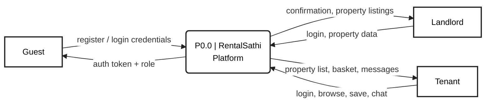
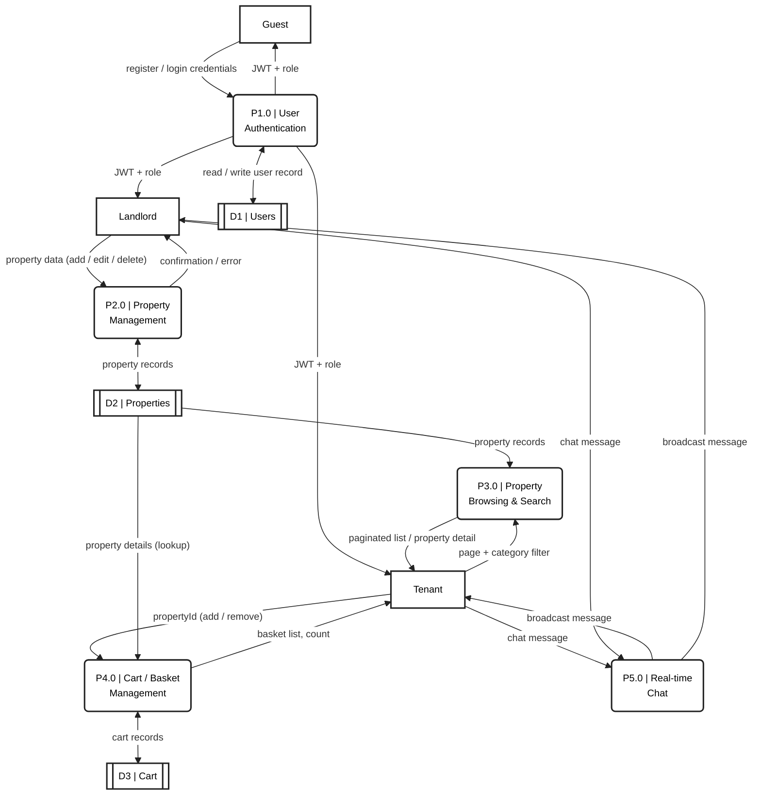
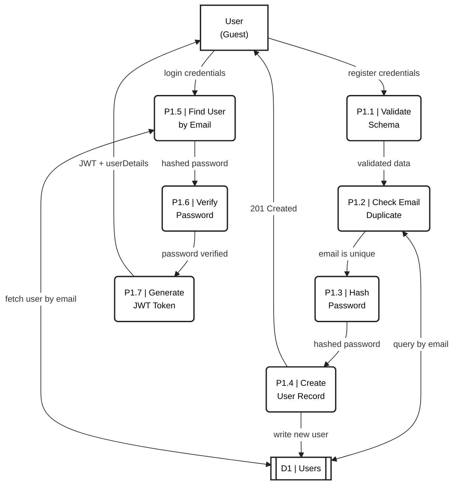

# Data Flow Diagram (DFD) — Gane and Sarson Notation

**Notation Legend (Gane and Sarson):**

| Mermaid Shape | Symbol Type | Meaning |
|---|---|---|
| `["Name"]` — plain rectangle | **External Entity** | Source or sink of data; exists outside the system boundary |
| `("P#.# \| Name")` — rounded rectangle | **Process** | Transforms or routes data; identified by process number |
| `[["D# \| Name"]]` — double-line rectangle | **Data Store** | Repository where data is held at rest |
| `-->\|"label"\|` — labelled arrow | **Data Flow** | Data in motion between elements |

---

## Level 0 – Context Diagram

Represents the entire RentalSathi platform as a single process (P0.0) and identifies all external entities that supply or receive data. No data stores appear at this level — only the system boundary and its actors.

---

## Level 1 – System Decomposition

Decomposes the platform into five primary processes and shows the data flows between them, the external entities, and the three data stores.

---

## Level 2 – User Authentication Sub-Process

Expands P1.0 (User Authentication) into its numbered sub-processes, showing both the registration and login paths and their interaction with the Users data store.

