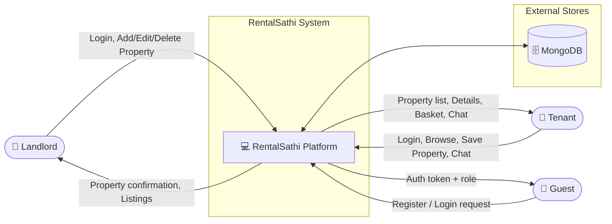
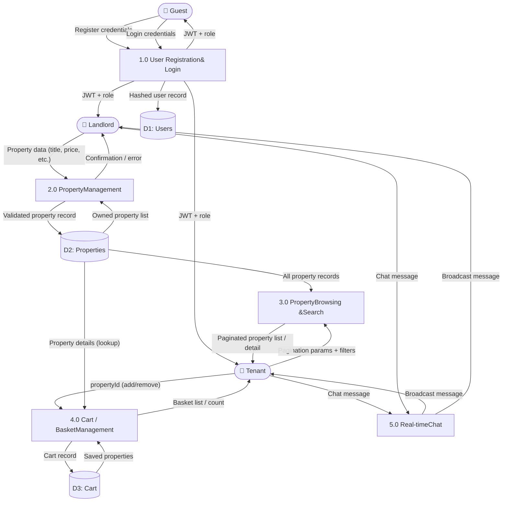
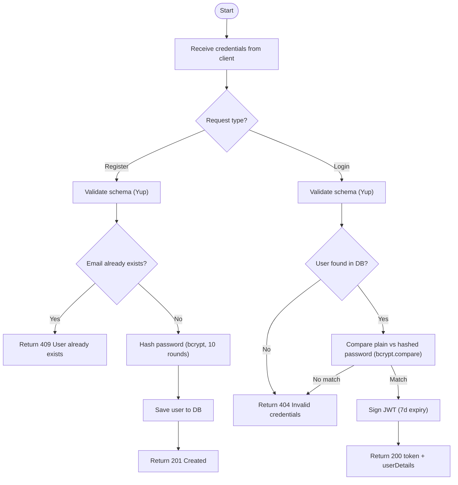

# Data Flow Diagram (DFD)

## Level 0 – Context Diagram

A context diagram shows the entire system as a single process and identifies the external entities that interact with it.

---

## Level 1 – System Decomposition

Level 1 decomposes the platform into its primary functional processes and shows how data flows between them.

---

## Level 2 – User Authentication Process (Expanded)

