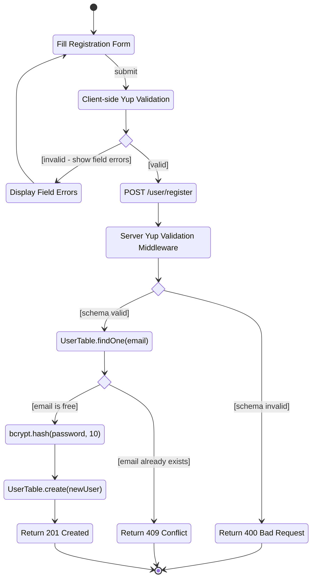
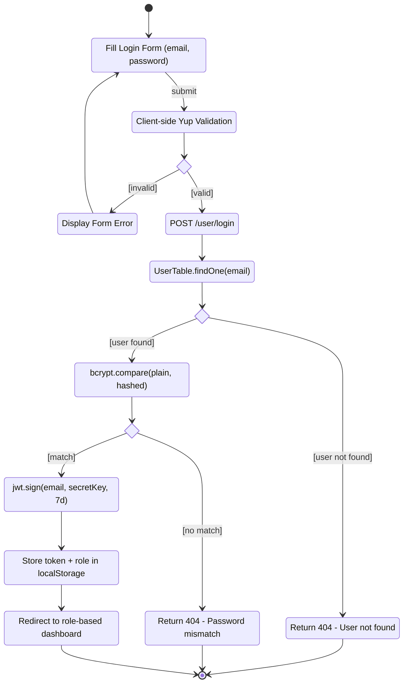
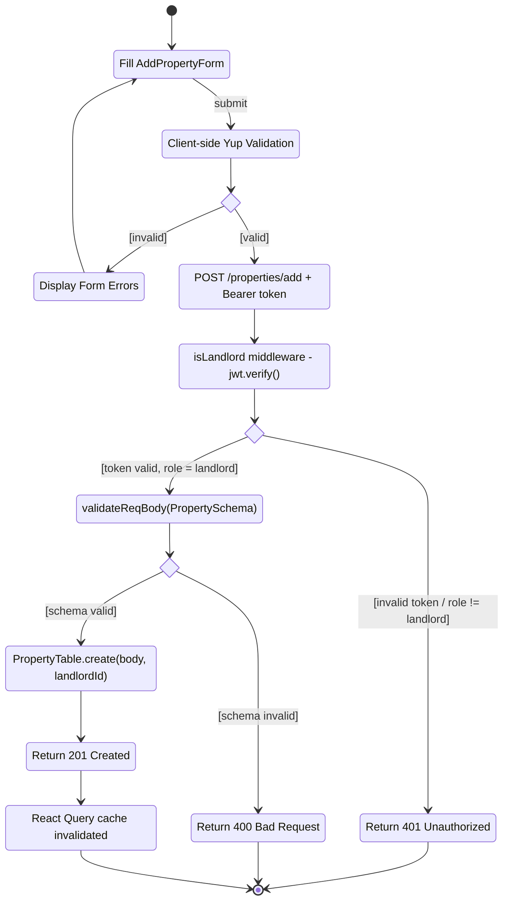
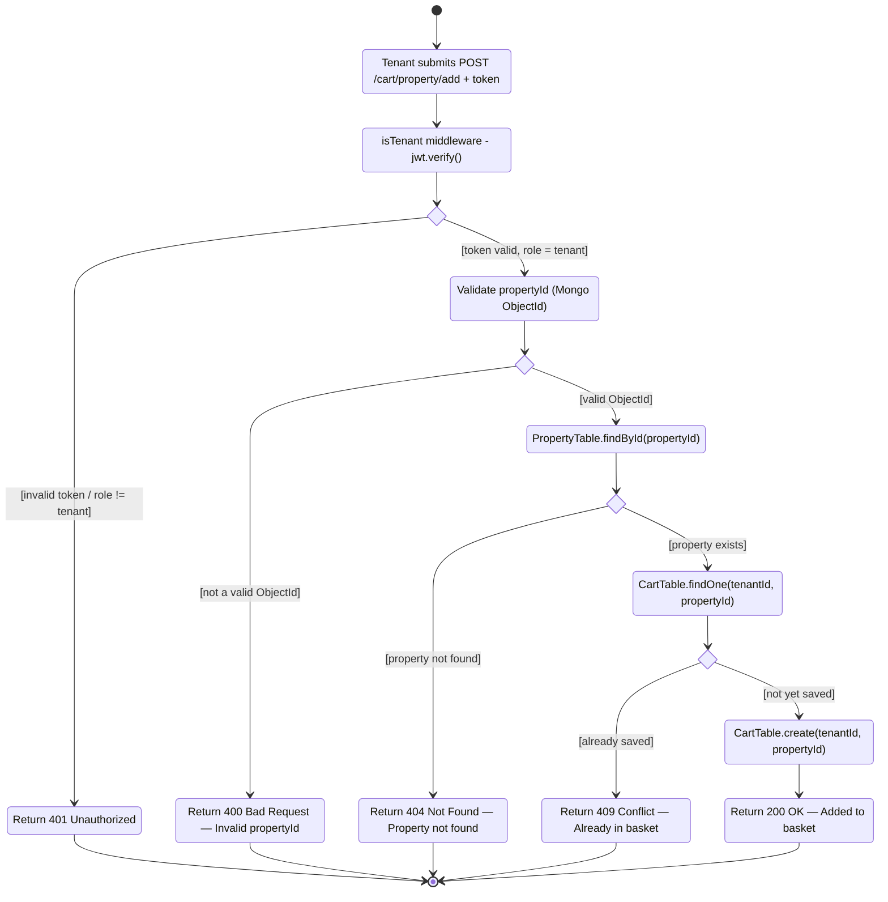
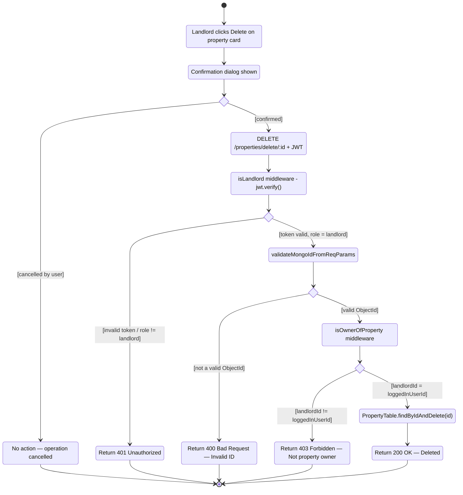

# Activity Diagrams — UML Notation

UML Activity Diagrams for the five core workflows of RentalSathi.

**Notation (UML Activity Diagram):**

| Symbol | Mermaid Element | Meaning |
|---|---|---|
| Filled circle ● | `[*]` at start | **Initial State** — entry point of the activity |
| Bullseye ◉ | `[*]` at end | **Final State** — termination of the activity |
| Rounded rectangle | Plain state node | **Action State** — an individual step or operation |
| Diamond ◇ | `state id <<choice>>` | **Decision Node** — branch based on guard condition |
| `[condition]` on arrow | `: [guard]` label | **Guard Condition** — transition fires only when true |
| Arrow | `-->` | **Control Flow** — sequence between actions |

---

## 1. User Registration

Covers the full registration flow from form entry through client validation, server schema check, duplicate email detection, bcrypt hashing, and account creation.

---

## 2. User Login

Covers the login flow from credential entry through client validation, user lookup, bcrypt comparison, JWT issuance, localStorage persistence, and role-based redirect.

---

## 3. Landlord: Add Property

Covers the property creation flow: client form validation, Bearer-token isLandlord middleware, server PropertySchema validation, database persistence, and React Query cache invalidation.

---

## 4. Tenant: Add Property to Basket

Illustrates the full middleware chain: isTenant JWT check, Mongo ObjectId validation, property existence check, duplicate cart entry check, and cart insertion.

---

## 5. Landlord: Delete Property

Covers the deletion flow: UI confirmation dialog, isLandlord JWT check, Mongo ObjectId validation, isOwnerOfProperty ownership check, and database deletion.

