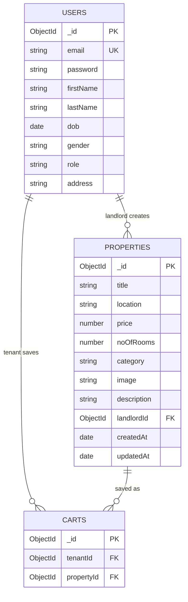
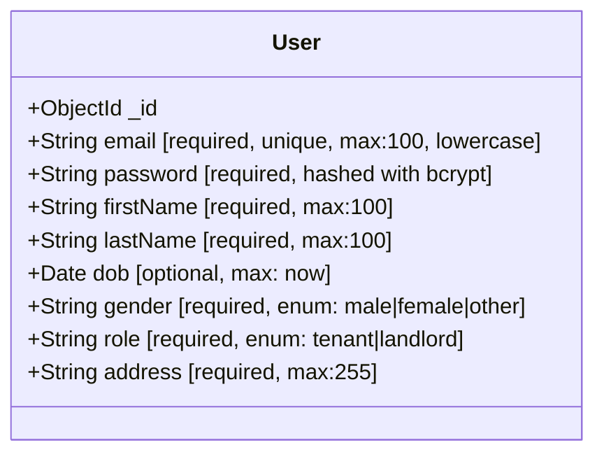
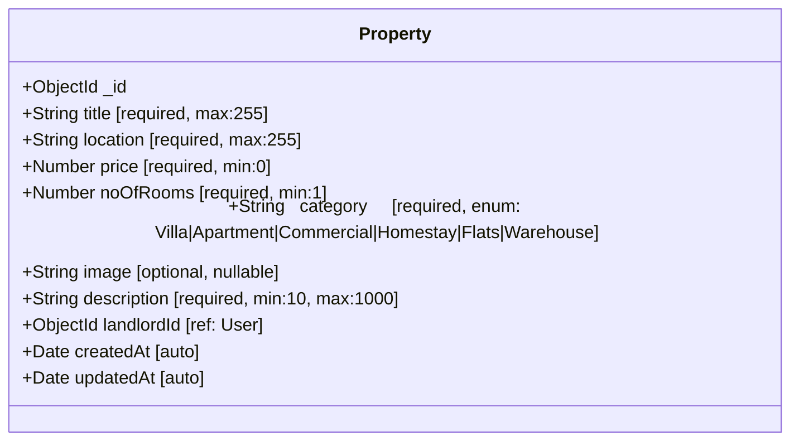
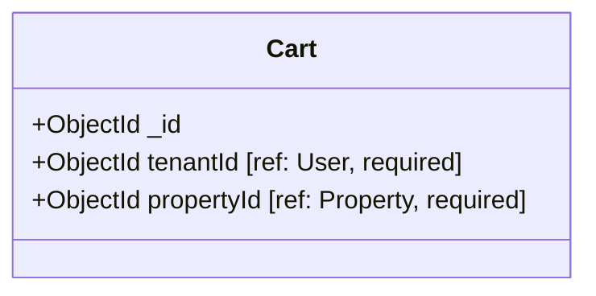
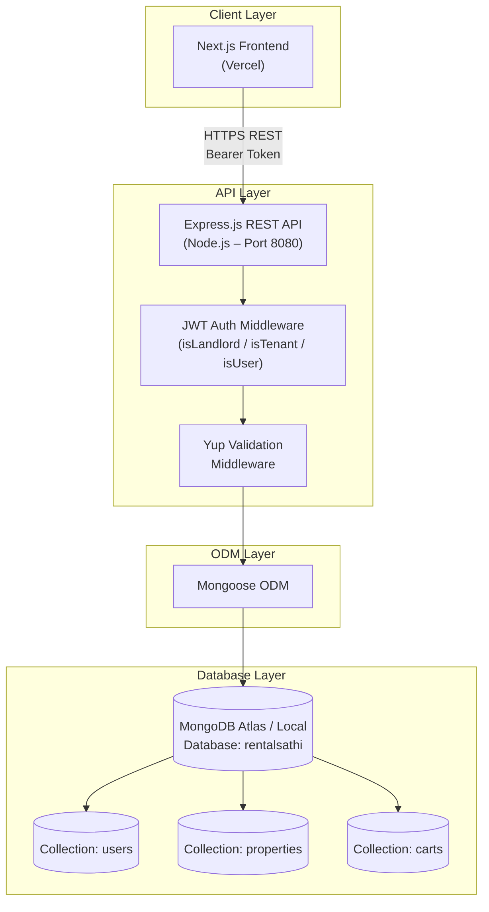

# Database Design & Architecture

## Overview

RentalSathi uses **MongoDB** (NoSQL document database) managed through the **Mongoose** ODM. There are three primary collections:

| Collection | Purpose |
|---|---|
| `users` | Stores registered landlord and tenant accounts |
| `properties` | Stores rental property listings created by landlords |
| `carts` | Stores the tenant's saved-property basket (wishlist) |

---

## Entity Relationship Diagram (ERD)

---

## Collection Schemas

### Users Collection

**Notes:**
- Password is never stored as plaintext; it is hashed using `bcrypt` with 10 salt rounds.
- `role` drives route-level authorization throughout the backend.
- `email` carries a unique index for fast lookups during authentication.

---

### Properties Collection

**Notes:**
- `landlordId` is a foreign-key reference to `_id` in the **Users** collection.
- Timestamps (`createdAt`, `updatedAt`) are managed automatically by Mongoose.
- Category is a strict enum allowing only: Villa, Apartment, Commercial, Homestay, Flats, Warehouse.

---

### Carts Collection

**Notes:**
- The pair `(tenantId, propertyId)` is functionally unique – the application prevents duplicate entries explicitly in the controller.
- `$lookup` aggregation is used to join property details when listing the cart.

---

## Database Architecture

---

## Indexes

| Collection | Field | Index Type | Reason |
|---|---|---|---|
| `users` | `email` | Unique | Fast login lookup, prevent duplicates |
| `properties` | `landlordId` | Default (ObjectId) | Filter landlord's own properties |
| `carts` | `tenantId` | Default (ObjectId) | Fetch all basket items for a tenant |

---

## Data Relationships Summary

| Relationship | Type | Implementation |
|---|---|---|
| User → Properties | One-to-Many | `properties.landlordId` references `users._id` |
| User → Cart | One-to-Many | `carts.tenantId` references `users._id` |
| Property → Cart | One-to-Many | `carts.propertyId` references `properties._id` |
| Cart → Property (display) | Lookup join | MongoDB `$lookup` aggregation on `GET /cart/list` |
