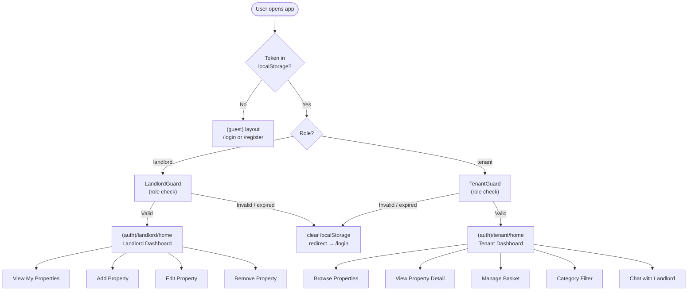
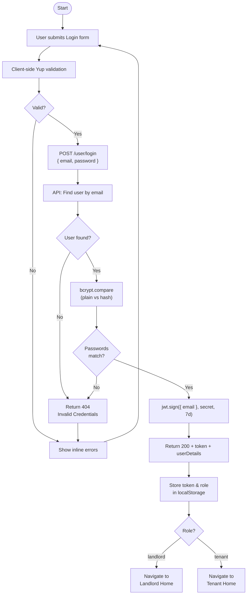
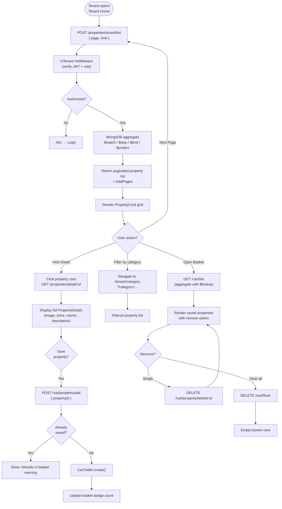
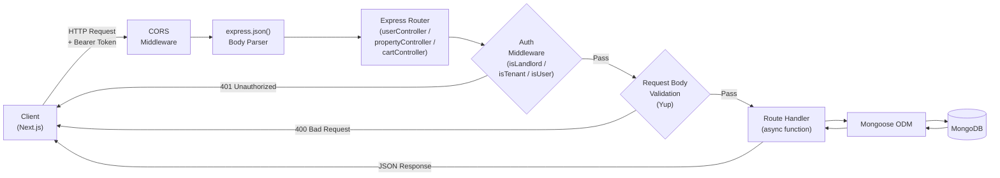
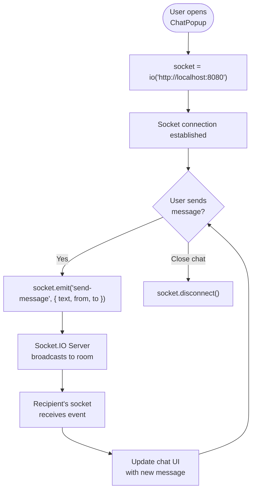

# Flow Diagrams

Flow diagrams describe the step-by-step logic and decision paths within each major process of RentalSathi.

---

## 1. Application-Level Route Flow

Shows how the Next.js App Router directs users based on authentication state and role.



---

## 2. Authentication Flow



---

## 3. Property Listing Flow (Landlord)

```mermaid
flowchart TD
    Start([Landlord clicks\n"Add Property"]) --> A["Navigate to\n/landlord/add-property"]
    A --> B["Fill AddPropertyForm\n(title, location, price,\nrooms, category, description, image)"]
    B --> C["Client Yup validation"]
    C --> D{Valid?}
    D -- "No" --> E["Show field errors"]
    E --> B
    D -- "Yes" --> F["POST /properties/add\nwith Bearer token"]
    F --> G["isLandlord middleware\nverify JWT + role"]
    G --> H{Auth OK?}
    H -- "No" --> I["401 → Redirect Login"]
    H -- "Yes" --> J["Yup server validation"]
    J --> K{Valid?}
    K -- "No" --> L["400 → Show error"]
    K -- "Yes" --> M["PropertyTable.create()\n with landlordId"]
    M --> N["201 Created"]
    N --> O["Show success toast\nNavigate to My Properties"]

    subgraph Edit ["Edit Property Flow"]
        E1["Landlord selects property\nto edit"] --> E2["GET /properties/detail/:id\nPre-fill EditPropertyForm"]
        E2 --> E3["Submit changes\nPUT /properties/update/:id"]
        E3 --> E4["isLandlord + isOwner\nmiddleware"]
        E4 --> E5{Authorized?}
        E5 -- "No" --> E6["403 Forbidden"]
        E5 -- "Yes" --> E7["Update document in DB"]
        E7 --> E8["200 OK → Refresh list"]
    end
```

---

## 4. Tenant Property Browse & Cart Flow



---

## 5. Backend Request Lifecycle Flow

Shows how every API request travels through the middleware stack before reaching the database.



---

## 6. Real-time Chat Flow


