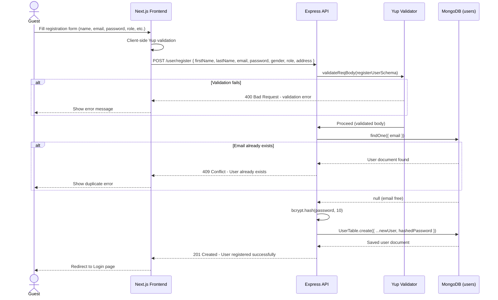
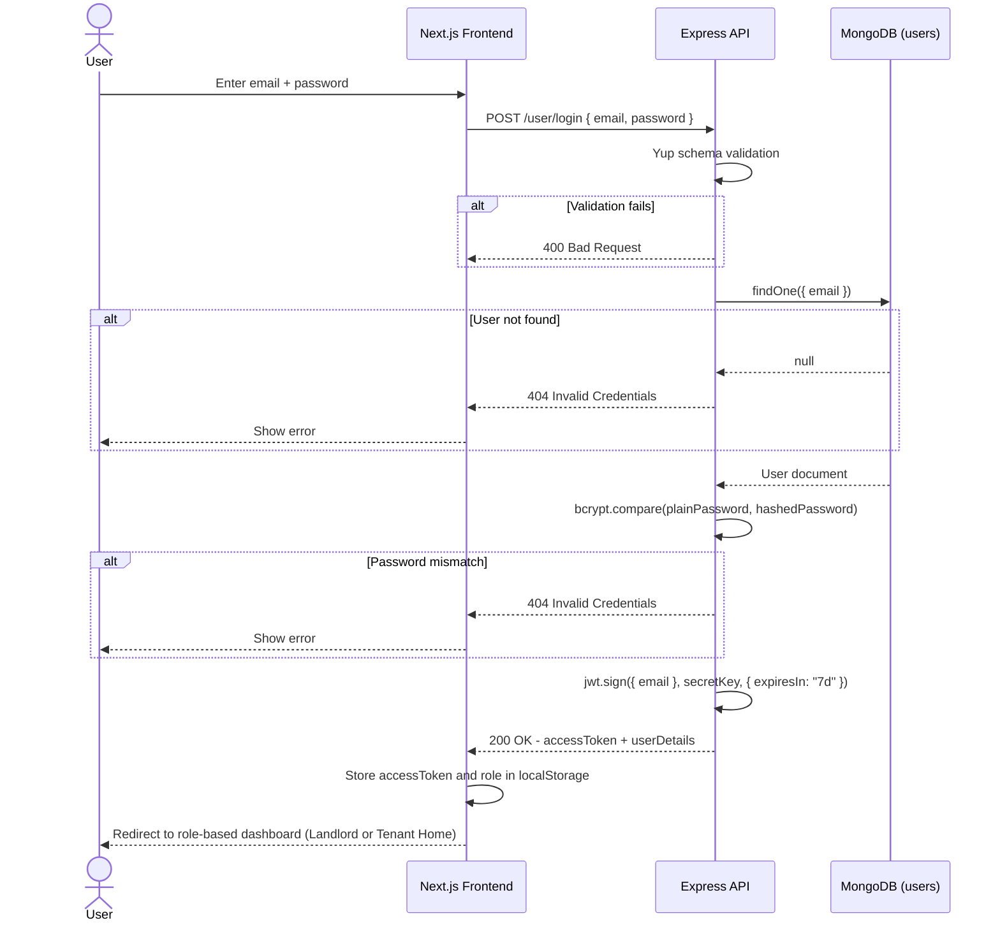
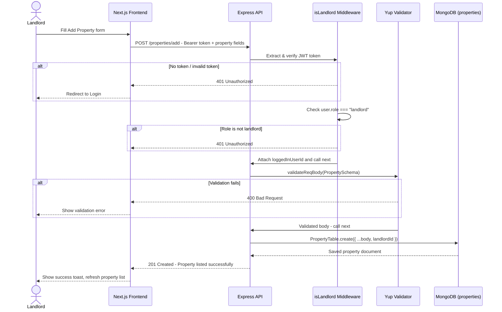
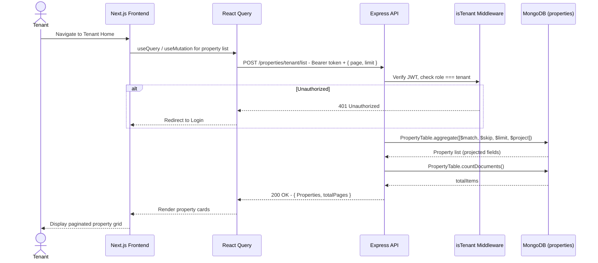
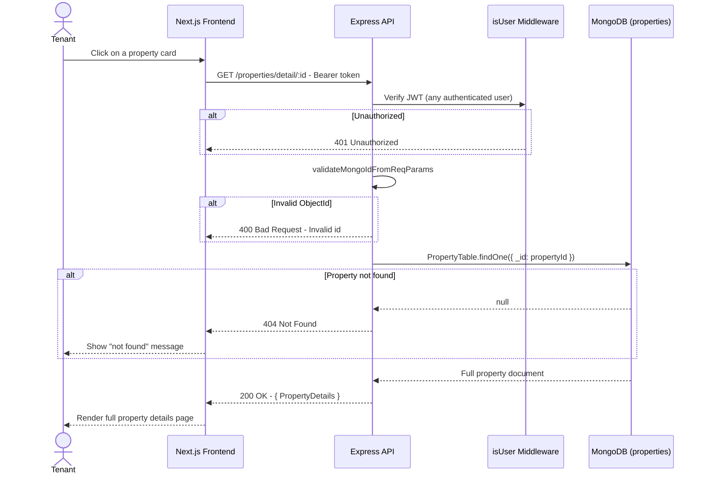
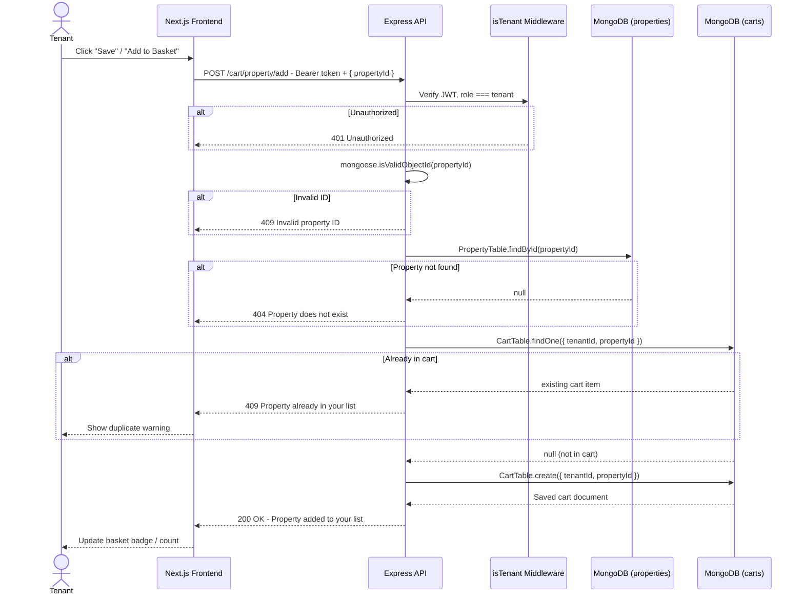
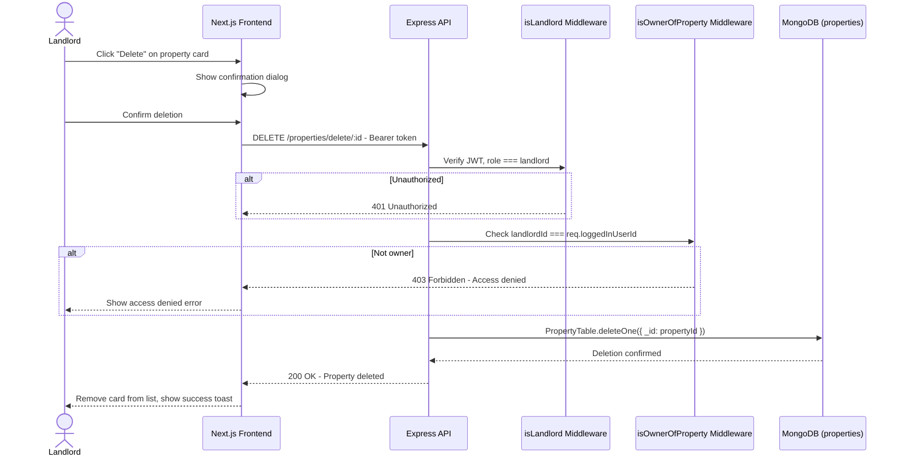

# Sequence Diagrams

Sequence diagrams show the time-ordered messaging between actors and system components for the key use cases of RentalSathi.

---

## 1. User Registration

---

## 2. User Login

---

## 3. Landlord – Add Property

---

## 4. Tenant – Browse Properties (Paginated)

---

## 5. Tenant – View Property Detail

---

## 6. Tenant – Add Property to Basket (Cart)

---

## 7. Landlord – Delete Property

